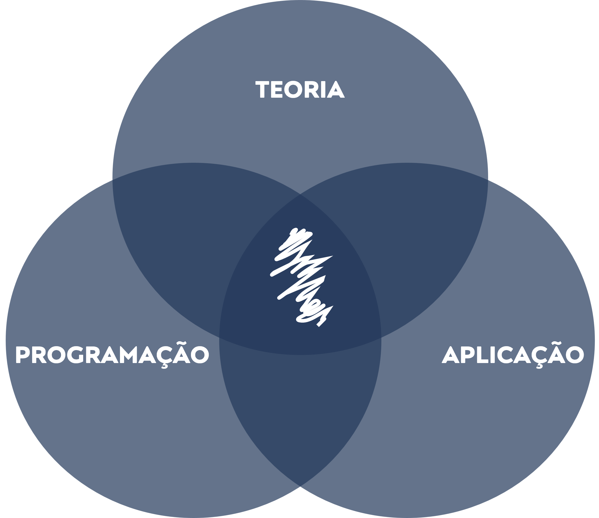

```{r ,echo=FALSE}

xaringanExtra::use_scribble()

xaringanExtra::use_search(show_icon = TRUE)

```

class: inverse, center, middle

# COMEÇOU A DISCIPLINA DE METODOLOGIA QUANTITATIVA

```{r, echo = F, fig.align = 'center', out.width = '50%'}
knitr::include_graphics(
  'https://media.giphy.com/media/citBl9yPwnUOs/giphy.gif')
```


---
## APRESENTAÇÃO

- [**QUEM É O PROFESSOR?**](#sobre_professor)

--

- [**QUEM SÃO OS PARTICIPANTES?**](#sobre_participantes)

--

- [**O QUE É METODOLOGIA QUANTITATIVA EM ADMINISTRAÇÃO?**](#ciencia_dados)

--

- [**QUAL O OBJETIVO DA DISCIPLINA?**](#objetivo_disciplina)

--

- [**COMO AS AULAS SERÃO ORGANIZADAS?**](#organizacao_aulas)

--

- [**COMO OS ATENDIMENTOS SERÃO ORGANIZADOS?**](#atendimentos)

--

- [**QUAL O CRONOGRAMA DA DISCIPLINA?**](#cronograma)


---
class: inverse, center, middle 
name: sobre_professor
# QUEM É O PROFESSOR?

```{r, echo = F, fig.align = 'center', out.width = '50%'}
knitr::include_graphics(
  'https://media.giphy.com/media/xT5LMVaLeMN0mGQM6c/giphy.gif')
```


---
<div style="text-align: justify">
## PRINCIPAIS INFORMAÇÕES
- **Nome:** *Victor Valerio*;

- **E-mail:** *victor.dmv@unifei.edu.br*;

- **Tel:** *+55 (35) 3629-1151*

- **Sala:** *B.3216 (1º Piso IEPG);*

- **Agenda:** https://valerio-victor.github.io/agenda


---
<div style="text-align: justify">
## FORMAÇÃO

- **GRADUAÇÃO**: Ciências Econômicas (UNESP);

- **MESTRADO**: Engenharia de Produção (UNIFEI)

- **DOUTORADO**: Engenharia de Produção (UNIFEI)


---
<div style="text-align: justify">
## ÁREAS DE ATUAÇÃO

- **DOCÊNCIA**: Economia (IEPG20), Engenharia Econômica (EPR502), 	
Macroeconomia (ADM022), Análise 	de 	Investimento com Risco (ADM013), 
Metodologia Quantitativa em Administração (MPA033);

- **PESQUISA**: Modelos de Análise de Eficiência e Produtividade, Análise de 
Viabilidade Econômica, Energia 	Renovável, Ciência de Dados;

- **INSTITUCIONAL**: Representante do Estado de Minas Gerais na Ordem dos Economistas do 
Brasil (OEB); Coordenador do Núcleo de Excelência em 	Sistemas Fotovoltaicos 
(NE-SFV); Pesquisador Assistente no Centro de 	Hidrogênio Verde (CHV2); 
Coordenador de Graduação em 	Administração na UNIFEI.


---
class: center, middle 
##PAI DE PET

```{r, echo = F, fig.align = 'center', fig.alt= 'Gif para agradecer pela atenção e o tema é da série the office', out.width = '30%'}


```


---
class: center, middle
## MAIOR DO PAÍS

```{r, echo = F, fig.align = 'center', fig.alt= 'Gif para agradecer pela atenção e o tema é da série the office', out.width = '40%'}

knitr::include_graphics(
  'https://media.giphy.com/media/ZeA9GkdqTLLm6I2Hab/giphy.gif')

```


---
class: inverse, center, middle 
name: sobre_professor

# QUEM SÃO OS PARTICIPANTES?

```{r, echo = F, fig.align = 'center', out.width = '50%'}
knitr::include_graphics(
  'https://media.giphy.com/media/26gBjgcJMUqShHs4w/giphy.gif')
```


---
<div style="text-align: justify">
## PERGUNTAS A SEREM RESPONDIDAS

- Qual o seu nome?

- Qual a sua área de atuação profissional?

- Qual o tema da sua dissertação?

- Você odeia matemática? Se matriculou na disciplina de maneira compulsória?

- Qual seu hobby? (esporte, filmes/séries, dormir, dançar, fofocar...)

- Conte uma curiosidade sobre você.


---
class: inverse, center, middle
name: ciencia_dados

# O QUE É METODOLOGIA QUANTITATIVA EM ADMINISTRAÇÃO?

```{r, echo = F, fig.align = 'center', out.width = '50%'}
knitr::include_graphics(
  'https://media.giphy.com/media/l2Jee9urV8szg0loY/giphy.gif')
```


---
<div style="text-align: justify">
## METODOLOGIA QUNATITATIVA EM ADMINISTRAÇÃO

Basicamente, esta disciplina foi organizada para ser uma introdução à 
**Ciência de Dados** (o nome foi criado com a finalidade de representar um 
proporcional oposto a outra disciplina do MPA, Metodologia Qualitativa em 
Administração).

Isto significa que vamos combinar conceitos de 
**estatística** e **programação** com a finalidade de gerar algum 
conhecimento a partir de um **conjunto de dados**. Mas podemos melhorar essa
definição.

---
<div style="text-align: justify">
## CIÊNCIA DE DADOS

Em geral, os cientistas utilizam o chamado **método de pesquisa** para 
formular sua teorias. Sem maior rigor conceitual, podemos resumir o que é 
**método de pesquisa** a partir de uma sequência de 5 passos: 

- **Passo I**: Formulação de uma hipótese (questão ou um problema);

- **Passo II**: Coleta de informações relacionadas ao passo anterior. Essas 
informações podem ser obtidas a partir de experimentos ou de observações
de variáveis de interesse;


---
<div style="text-align: justify">
## CIÊNCIA DE DADOS

- **Passo III**: Aplicação de técnicas para formulação de alguma conclusão 
sobre a hipótese (questão ou um problema);

- **Passo IV**: Aplicação de teste da qualidade da conclusão obtida 
(confrontação com a realidade com a finalidade de falsear a conclusão);

- **Passo V**: Revisão de todos os passos anteriores. Condicionado ao 
resultado do passo anterior (apenas se a conclusão obtida não for válida).


---
<div style="text-align: justify">
## CIÊNCIA DE DADOS

Por sua vez, pode-se afirmar que a **estatística** é a parte da ciência 
voltada a **coletar**, **resumir**, **analisar** e **modelar** informações 
coletadas a respeito de determinado fenômeno (**dados**);

A partir da definição anterior, fica claro que a estatística é fundamental 
para o método de pesquisa, uma vez que, é a partir dela pode-se proceder os 
passos II, III e IV.


---
<div style="text-align: justify">
## CIÊNCIA DE DADOS

Ainda sobre o conceito de estatística, pode-se afirmar que a mesma pode ser
divida em duas grandes partes: 

- **Análise Exploratória de Dados**: Tem por objetivo realizar o resumo e 
interpretação inicial das informações coletadas (dados);

- **Inferência Estatística**: Totalmente dependente da primeira, tem por 
objetivo modelar as informações de modo a gerar alguma conclusão 
generalizável.


---
<div style="text-align: justify">
## CIÊNCIA DE DADOS

Em associação, o crescente **desenvolvimento computacional** acabou por 
impactar fortemente o cotidiano dos pesquisadores, visto que, acabou por 
**facilitar a implementação das mais diversas técnicas estatísticas** a 
partir da utilização de **softwares dedicados** (uso exclusivo de estatística, 
Minitab, SPSS, etc.), ou **não dedicados** (uso não exclusivo da estatística, 
Excel, Python, R, Julia, Etc.);

Em geral, os **softwares dedicados** são mais amigáveis por possuírem menus 
para execução das análises que se dão por meio de botões.


---
<div style="text-align: justify">
## CIÊNCIA DE DADOS

De outro lado, os softwares não dedicados requerem alguma familiaridade com 
**linguagem de programação**. Mas eles expandem os limites das aplicações, 
resolvendo **problemas anteriores** à estatística (**arrumação e 
transformação** dos dados)  e **problemas posteriores** aos resultados (**
automatização e comunicação**). 

Essas aplicações expandidas à estatística (mais uma vez, **arrumação, 
transformação, automatização e comunicação**) compõem o que é chamado de 
**Ciência de Dados**. Portanto, objetivo da nossa disciplina!


---
<div style="text-align: justify">
## CIÊNCIA DE DADOS

Representação do Ciclo da Ciência de Dados: 

```{r, echo = F, fig.align = 'center', out.width = '75%'}
knitr::include_graphics('ciclo_ciencia_dados.png')
```


---
class: inverse, center, middle
name: objetivo_disciplina

# QUAL O OBJETIVO DA DISCIPLINA?

```{r, echo = F, fig.align = 'center', out.width = '50%'}
knitr::include_graphics(
  'https://media.giphy.com/media/xT5LMsv6xxHIxliEOA/giphy.gif')
```


---
<div style="text-align: justify">
## OBJETIVO GERAL DA DISCIPLINA

Assim, pode-se afirmar que o **objetivo geral** da disciplina de 
**Metodologia Quantitativa em Administração** consiste habilitar o estudante
a "**tirar conclusões consistentes**" a partir de um de um **conjunto de 
dados** relacionados a um determinado contexto (pesquisa ou atividade 
profissional). Tendo como plano de fundo para isso a **Ciência de Dados**.


---
<div style="text-align: justify">
## OBJETIVO GERAL DA DISCIPLINA

O grande desafio da disciplina é conciliar as diversas áreas de conhecimento.

--
```{r, echo = F, fig.align = 'center', out.width = '40%'}

```


---
class: inverse, center, middle
name: organizacao_aulas

# COMO AS AULAS SERÃO ORGANIZADAS?

```{r, echo = F, fig.align = 'center', out.width = '50%'}
knitr::include_graphics(
  'https://media.giphy.com/media/fBEDuhnVCiP16/giphy.gif')
```

---
<div style="text-align: justify">
## ORGANIZAÇÃO DAS AULAS

Em geral, nossas aulas serão separadas em duas partes:

- **Teoria (8:50h às 10:30h)**
  - Aulas expositivas com foco nos conceitos e suas aplicações;
  - Apresentações de problemas reais (inclusão do contexto de cada estudante, 
quando possível).

- **Programação (11h às 11:55h)**
  - Aulas práticas em laboratório com foco em conceitos da Ciências de Dados
  (inclusão do contexto de cada estudante, quando possível).

---
class: inverse, center, middle
name: atendimentos

# COMO OS ATENDIMENTOS SERÃO ORGANIZADOS?

```{r, echo = F, fig.align = 'center', fig.alt= 'Gif da série the office para apresentar a organização dos atendimentos ', out.width = '50%'}
knitr::include_graphics(
  'https://media.giphy.com/media/vEJGsXtEE1Sc8/giphy-downsized-large.gif')
```

---
<div style="text-align: justify">
## ORGANIZAÇÃO DOS ATENDIMENTOS

Basicamente, teremos duas formas de atendimento para discutir dúvidas 
conceituais, aplicações específicas ao contexto de cada estudante ou mesmo 
dúvidas de programação.

- **REUNIÕES VIRTUAIS**

- **REUNIÕES PRESENCIAIS**

Em todas as formas você deverá agendar a reunião clicando  [**AQUI**](https://valerio-victor.github.io/agenda). Uma **dica** 
é dar preferência para as **reuniões virtuais** pois elas poderão ser 
gravadas e, assim, utilizadas para estudos futuros! 

---
class: inverse, center, middle
name: cronograma

# QUAL O CRONOGRAMA E QUAIS OS CONTEÚDOS DA DISCIPLINA?

```{r, echo = F, fig.align = 'center', fig.alt= 'Gif da série the office para apresentar a organização dos atendimentos ', out.width = '50%'}
knitr::include_graphics(
  'https://media.giphy.com/media/l2JdZgzUpaNi2oxcQ/giphy.gif')
```

---
.pull-left[
```{r , results = 'asis', echo = F, warning = F, message = F, error = F, fig.align ='center', out.width = '100%'}
library(magrittr)
library(kableExtra)

cronograma <- data.frame(
  
  AULA = c(1, 2, 3, 4, 5, 6, 7, 8),
  
  DIA = c('13/03', '20/03', '27/03', '03/04', '10/04', '17/04', '24/04', '15/05'),
  
  TEMAS = c('Apresentação da Disciplina',
           'Nivelamento em Programação', 
           'Conceitos Básicos', 
           'Medidas de Tendência Central',
           'Medidas de Dispersão',
           'Medidas de Relação',
           'Análise Gráfica', 
           'Trabalho'))

knitr::kable(cronograma, 
             
             escape = FALSE,
    
             format = 'html',
             
             align = c('c', 'l', 'l')) %>%
  
  kable_styling(bootstrap_options = 'striped')

```
]

.pull-right[
```{r , results = 'asis', echo = F, warning = F, message = F, error = F, fig.align ='center', out.width = '100%'}
library(magrittr)
library(kableExtra)

cronograma <- data.frame(
  
  AULA = c(9, 10, 11, 12, 13, 14, 15, 16),
  
  DIA = c('22/05', '29/05', '05/06', '12/06', '19/06', '26/06', '03/07', '10/07'),
  
  TEMAS = c('Relatórios Dinâmicos',
            'Curva Normal e Propriedades', 
           'Teste de Hipótese (Amostra Única)', 
           'Teste de Hipótese (Duas Amostras)',
           'Teste de Hipótese (Mais Amostras)',
           'Regressão',
           'Consultoria', 
           'Trabalho'))

knitr::kable(cronograma, 
             
             escape = FALSE,
    
             format = 'html',
             
             align = c('c', 'l', 'l')) %>%
  
  kable_styling(bootstrap_options = 'striped')

```
]


---
## COMPOSIÇÃO DAS NOTAS

- Equação Nota 1: $Nota_1  = 0,8. Trabalho_{parte 1} + 0,2.Questionários_{parte 1}$

- Equação Nota 2: $Nota_2  = 0,8 .Trabalho_{parte 2} + 0,2.Questionários_{parte 2}$

- Equação Nota Final: $Nota_{Final}  = (Nota_1 + Nota_2)/2$

---
class: inverse, center, middle

# MUITO OBRIGADO!

```{r, echo = F, fig.align = 'center', fig.alt= 'Gif para agradecer pela atenção e o tema é da série the office', out.width = '50%'}

knitr::include_graphics(
  'https://media.giphy.com/media/3orifgJJHKP0WZxmzC/giphy.gif')

```


